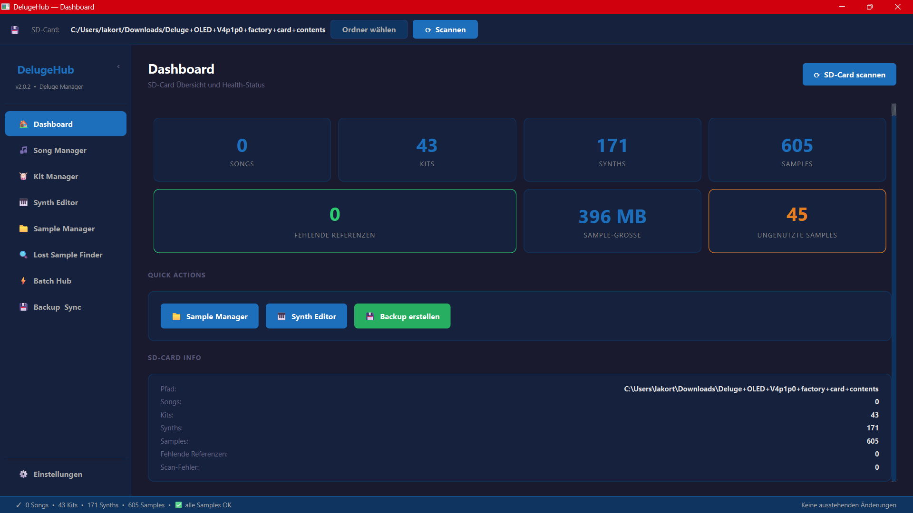
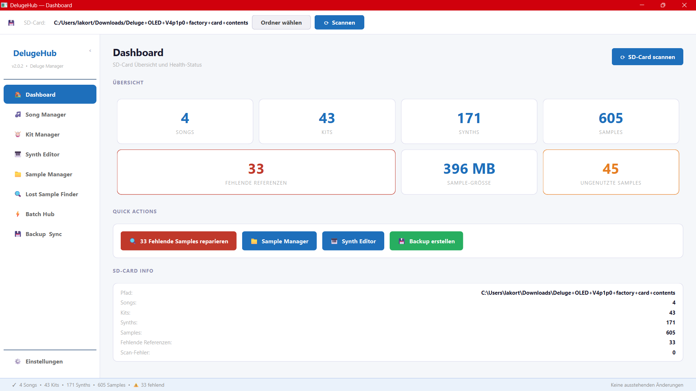

# DelugeHub

**All-in-One SD Card Manager for the Synthstrom Deluge**


DelugeHub is a desktop application for managing the SD card of the [Synthstrom Deluge](https://synthstrom.com/product/deluge/) synthesizer. It lets you browse, edit, rename and export songs, kits, synths and samples — all from your computer, with a non-destructive staging system that only writes changes to disk when you say so.

---

## Screenshots

| Dashboard (Dark) | Dashboard (Light) |
|---|---|
|  |  |

---

## Features

| Module | Description |
|---|---|
| 🎵 **Song Manager** | Browse, rename, duplicate and export songs with all dependencies |
| 🥁 **Kit Manager** | Edit kits & pad assignments, normalize and cap volumes |
| 🎹 **Synth Editor** | Edit parameters, randomizer, import/export |
| 📁 **Sample Manager** | Folder tree, preview, move/rename with automatic XML path update |
| 🔍 **Lost Sample Finder** | Find missing samples, auto-match, batch fix |
| ⚡ **Batch Hub** | Bulk rename, export, delete, normalize across all content types |
| 💾 **Backup & Sync** | Create ZIP backups, manage history, selectively restore |
| ⚙️ **Settings** | SD path, theme (dark/light), auto-scan |

---

## Requirements

- Python 3.10 or newer
- [PySide6](https://pypi.org/project/PySide6/) >= 6.6.0
- [lxml](https://pypi.org/project/lxml/) >= 5.0.0
- Windows, macOS or Linux
- Optional: `sounddevice` + `numpy` for audio preview in Sample Manager

---

## Installation

### Run from source

```bash
pip install -r requirements.txt
python main.py
```

Optional audio preview:

```bash
pip install sounddevice numpy
```

### Windows installer (no Python required)

Download `DelugeHub-2.0.4-Setup.exe` from the [latest release](https://github.com/LakortWPS/DelugeHub/releases/latest) and run it. No Python installation needed.

---

## Project Structure

```
DelugeHub/
├── main.py                  ← Entry point
├── requirements.txt
├── CHANGELOG.md
├── installer/               ← Windows installer build system
│   ├── DelugeHub.spec       ← PyInstaller config
│   ├── setup.iss            ← Inno Setup script
│   ├── build_installer.bat  ← One-click build script
│   └── README.md            ← Build instructions
└── app/
    ├── main_window.py       ← Main window, StagingStore, status bar
    ├── theme.py             ← Dark + Light QSS stylesheets
    ├── core/
    │   ├── models.py        ← Data models (Song, Kit, Synth, …)
    │   ├── xml_parser.py    ← Deluge XML parser (firmware 1.x + 2.x)
    │   ├── sd_scanner.py    ← Async SD-card scanner
    │   ├── file_ops.py      ← File operations + XML path update
    │   ├── staging.py       ← StagingStore, PendingChange, ChangeType
    │   ├── volume_utils.py  ← Deluge volume encoding helpers (shared)
    │   ├── lost_finder.py   ← Lost sample logic
    │   └── backup.py        ← Backup/restore, ZIP management
    ├── widgets/
    │   └── pending_panel.py ← PendingPanel widget (staging display)
    └── modules/
        ├── song_manager.py
        ├── kit_manager.py
        ├── synth_editor.py
        ├── sample_manager.py
        ├── lost_sample_finder.py
        ├── batch_hub.py
        ├── backup_sync.py
        └── settings_module.py
```

---

## Building a Windows Installer

See [installer/README.md](installer/README.md) for full instructions.

**Requirements:** PyInstaller + Inno Setup 6

```
installer\build_installer.bat
```

**Output:** `installer\output\DelugeHub-2.0.4-Setup.exe`

---

## Changelog

See [CHANGELOG.md](CHANGELOG.md) for the full version history.

**Latest:** [v2.0.4](https://github.com/LakortWPS/DelugeHub/releases/tag/v2.0.4) — Bugfix release: synth editor parameter save collision fix (parent-block scoping), Inno Setup deprecation warnings resolved.

---

## License

This project is licensed under the [MIT License](LICENSE).
